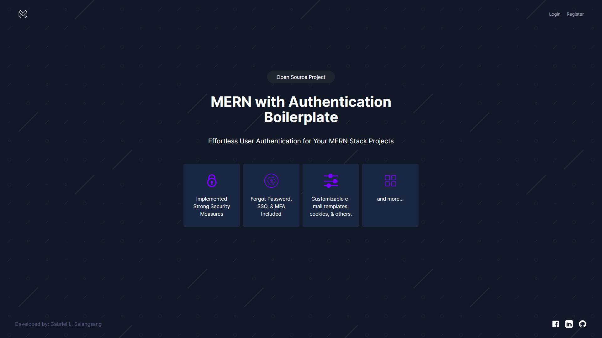
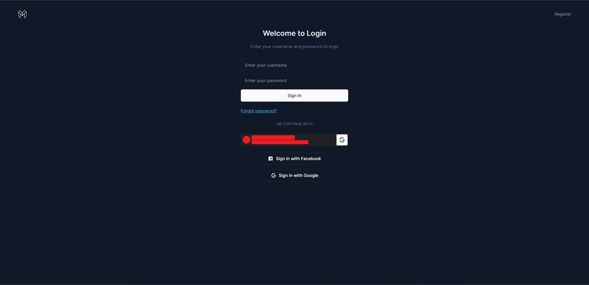
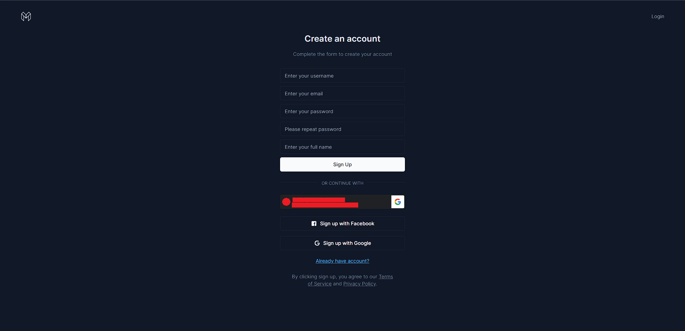
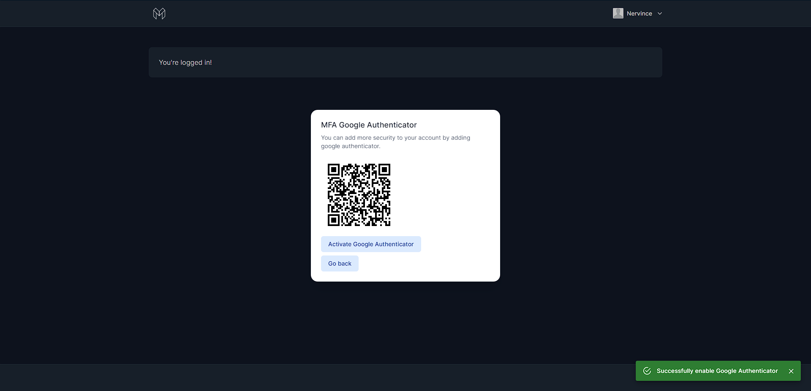
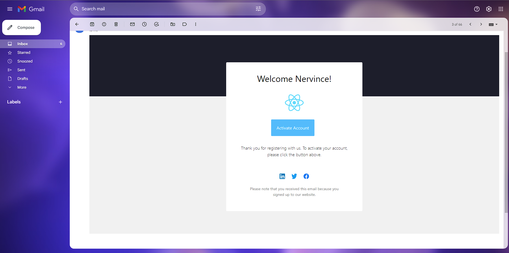
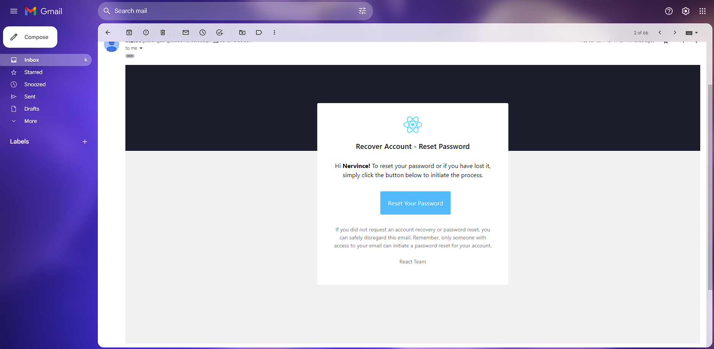
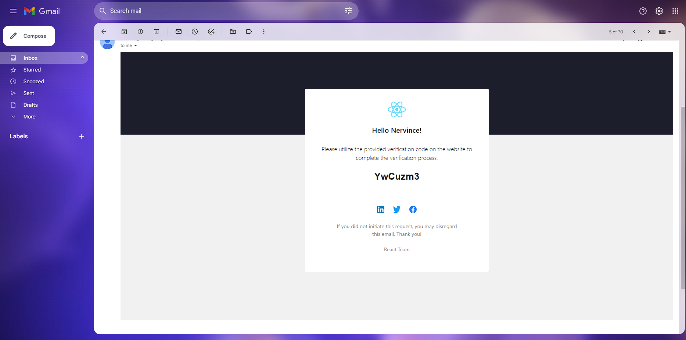

# Typescript MERN with Authentication using JWT Boilerplate 

This is my boilerplate for building MERN Stack application monolithic architecture. Most application need authencation and building MERN stack starting with authentication is very hassle that's why I decided to create a ready made MERN stack with authentication.

Feel free to fork this project to improve the UI, structure, performance, and security of this application.

Features:
- IMPLEMENTED STRONG SECURITY MEASURES
- ACCOUNT ACTIVATION VIA EMAIL
- TWO/MULTI FACTOR AUTHENTICATION VERIFICATION LOGIN CODE
- FIREBASE FACEBOOK SSO OAuth 2.0
- GOOGLE IDENTITY SERVICES SSO OAuth 2.0
- GOOGLE IDENTITY SERVICES ONE TAP PROMPT OAuth 2.0
- FORGOT PASSWORD, RECOVERY ACCOUNT RESET PASSWORD
- CUSTOMIZABLE AUTHENTICATION SUCH AS COOKIES, JWT, AND USER SETTINGS
- ERROR CODES GUIDELINES
- CUSTOMIZABLE EMAIL TEMPLATES
- SCALED NODEJS SERVER WITH AUTOMATICALLY HANDLE LOAD BALANCING

Security Measures Implemented (Basic-Advanced):
- XSS ATTACK
- NOSQL INJECTION ATTACK
- SQL INJECTION ATTACK (AND OTHER CODE INJECTION ATTACKS)
- DOS ATTACK
- DDOS ATTACK
- BRUTE-FORCE ATTACKS
- CSRF ATTACK
- RCE ATTACK
- COOKIE POISONING ATTACK
- UI REDRESS ATTACK
- TOKEN LEAKAGE
- TOKEN TAMPERING ATTACK
- TOKEN REPLAY
- PASSWORD HACKING
- INFORMATION LEAKAGE

More images:

