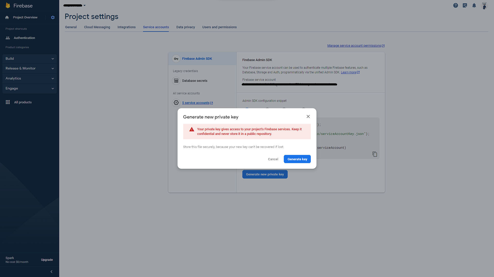

# Typescript MERN with Authentication using JWT Boilerplate 


This is my boilerplate for building MERN Stack application monolithic architecture. Most application need authencation and building MERN stack starting with authentication is very hassle that's why I decided to create a ready made MERN stack with authentication.

Feel free to fork this project to improve the UI, structure, performance, and security of this application.

## How to use?

#### 1. Clone the repo.
```sh
$ git clone https://github.com/GabrielSalangsang013/ts-mern-with-auth-boilerplate.git
```

#### 2. Open the project in VS code.

#### 3. Open new VS code terminal.

#### 4. Go inside the backend folder, and install all the packages.
```sh
$ cd backend
$ npm install
```

#### 5. Create .env file and fill up the credentials (still inside backend folder).
```
# TYPE OF NODE ENVIRONMENT
NODE_ENV=DEVELOPMENT

# PORT OF SERVER
PORT=4000

# REACT URL - FRONTEND
REACT_URL=http://localhost:3000

# MONGO DATABASE URI
MONGO_DB_URI=
MONGO_DB_URI_LIMITER=

# SECRETS
(Create secret using this code "node require('crypto').randomBytes(64).toString('hex');")
AUTHENTICATION_TOKEN_SECRET=
ACCOUNT_ACTIVATION_TOKEN_SECRET=
ACCOUNT_RECOVERY_RESET_PASSWORD_TOKEN_SECRET=
ACCOUNT_RECOVERY_RESET_PASSWORD_CSRF_TOKEN_SECRET=
MFA_TOKEN_SECRET=
PUBLIC_CSRF_TOKEN_SECRET=

# SMTP CONFIGURATION. USED BREVO FORMERLY SENDINBLUE EMAIL SERVICES
SMTP_HOST=
SMTP_PORT=
SMTP_USER=
SMTP_PASSWORD=
EMAIL_FROM=

# GOOGLE AUTHENTICATOR SECRET
(Create secret using this code "node require('crypto').randomBytes(64).toString('hex');")
GOOGLE_AUTHENTICATOR_NAME=MERN-Auth

# SSO GOOGLE IDENTITY SERVICES
(Follow this tutorial on how to create GIS Client ID - [https://youtu.be/HtJKUQXmtok?si=gwlFBdj-vIt-XoSR])
GOOGLE_IDENITY_SERVICES_CLIENT_ID=
```

#### 6. Go to [https://firebase.google.com/](firebase) and create a firebase project.

#### 7. In your firebase project, go to the project settings.


#### 8. In project settings, go to the "Service accounts" tab, click "Generate new private key" button, and click "Generate key". 


#### 9. After that you will receive a downloaded file which contains the firebase admin key. Open the file and copy all the contents.

#### 10. Now go back in the VS code and go inside the backend project, go to the src/config folder and create firebase-credential.json and paste the Firebase config object.
```
{
  "type": <The value from the downloaded file>,
  "project_id": <The value from the downloaded file>,
  "private_key_id": <The value from the downloaded file>,
  "private_key": <The value from the downloaded file>,
  "client_email": <The value from the downloaded file>,
  "client_id": <The value from the downloaded file>,
  "auth_uri": <The value from the downloaded file>,
  "token_uri": <The value from the downloaded file>,
  "auth_provider_x509_cert_url": <The value from the downloaded file>,
  "client_x509_cert_url": <The value from the downloaded file>,
  "universe_domain": <The value from the downloaded file>
}
```

#### 11. Run the backend server.
```sh
$ npm start
```

#### 12. Open another new VS code terminal and go to frontend folder.
```sh
$ cd frontend
$ npm install
```

#### 13. Create .env file and fill up the credentials (still inside frontend folder).
```
REACT_APP_API=http://localhost:4000

# FIREBASE SSO CRENDENTIAL
(You can get firebase credentials in the project settings also but in "General" tab only. Scroll down and click the npm input radio button and copy the firebaseConfig variable value and put it in this .env file)
REACT_APP_SSO_FIREBASE_API_KEY=
REACT_APP_SSO_FIREBASE_AUTH_DOMAIN=
REACT_APP_SSO_FIREBASE_PROJECT_ID=
REACT_APP_SSO_FIREBASE_STORAGE_BUCKET=
REACT_APP_SSO_FIREBASE_MESSAGING_SENDER_ID=
REACT_APP_SSO_FIREBASE_APP_ID=
REACT_APP_SSO_FIREBASE_MEASUREMENT_ID=

# GOOGLE IDENTITY SERVICES SSO CRENDENTIAL
(Follow this tutorial on how to create GIS Client ID - [https://youtu.be/HtJKUQXmtok?si=gwlFBdj-vIt-XoSR])
REACT_APP_SSO_GOOGLE_IDENITY_SERVICES_CLIENT_ID=
```
Image where to get the firebase credential in the firebase project settings.


#### 14. Run the frontend server.

```sh
$ npm start
```

### Features:
- IMPLEMENTED STRONG SECURITY MEASURES
- ACCOUNT ACTIVATION VIA EMAIL
- TWO/MULTI FACTOR AUTHENTICATION VERIFICATION LOGIN CODE
- FIREBASE FACEBOOK SSO OAuth 2.0
- GOOGLE IDENTITY SERVICES SSO OAuth 2.0
- GOOGLE IDENTITY SERVICES ONE TAP PROMPT OAuth 2.0
- FORGOT PASSWORD, RECOVERY ACCOUNT RESET PASSWORD
- CUSTOMIZABLE AUTHENTICATION SUCH AS COOKIES, JWT, AND USER SETTINGS
- ERROR CODES GUIDELINES
- CUSTOMIZABLE EMAIL TEMPLATES
- SCALED NODEJS SERVER WITH AUTOMATICALLY HANDLE LOAD BALANCING

### Security Measures Implemented (Basic-Advanced):
- XSS ATTACK
- NOSQL INJECTION ATTACK
- SQL INJECTION ATTACK (AND OTHER CODE INJECTION ATTACKS)
- DOS ATTACK
- DDOS ATTACK
- BRUTE-FORCE ATTACKS
- CSRF ATTACK
- RCE ATTACK
- COOKIE POISONING ATTACK
- UI REDRESS ATTACK
- TOKEN LEAKAGE
- TOKEN TAMPERING ATTACK
- TOKEN REPLAY
- PASSWORD HACKING
- INFORMATION LEAKAGE

#### More images:


